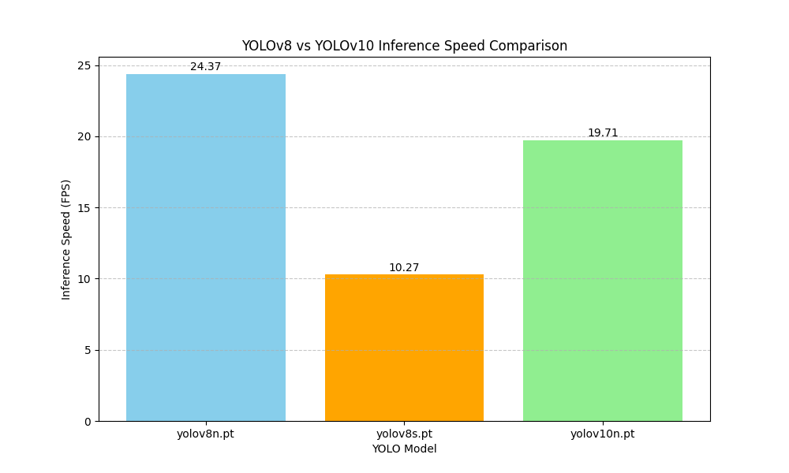

# YOLO Benchmark Results

**Source Data:** `Ambulance.mp4`  
**Device:** `cpu`

| Model       |   Avg Inference (ms) |   FPS |   Total Objects Detected |   Model Size (M Parameters) |
|:------------|---------------------:|------:|-------------------------:|----------------------------:|
| yolov8n.pt  |                41.04 | 24.37 |                     4700 |                        3.16 |
| yolov8s.pt  |                97.33 | 10.27 |                     8040 |                       11.17 |
| yolov10n.pt |                50.74 | 19.71 |                     4333 |                        2.78 |

