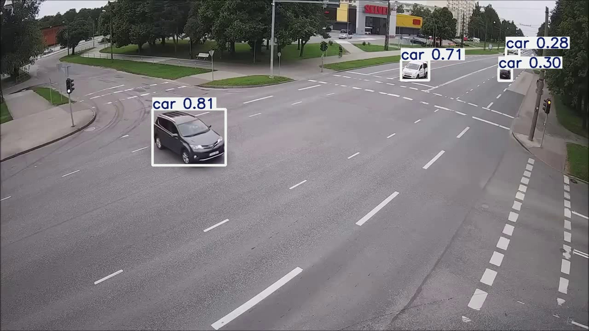
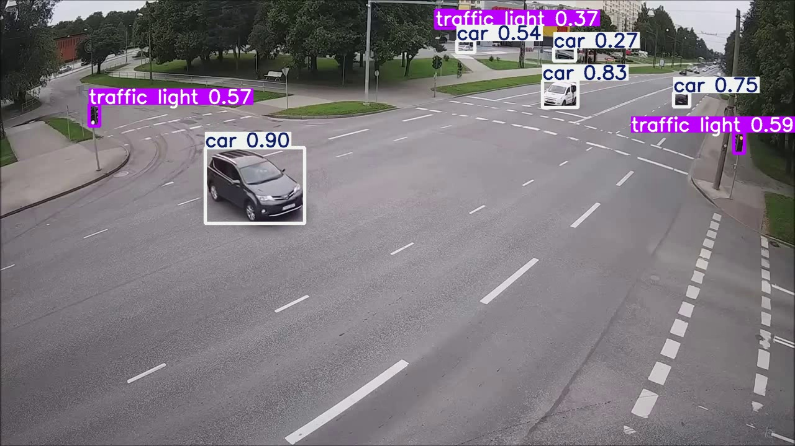
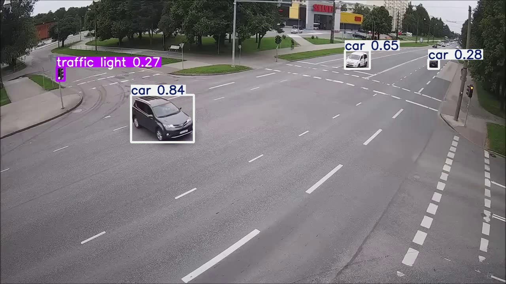
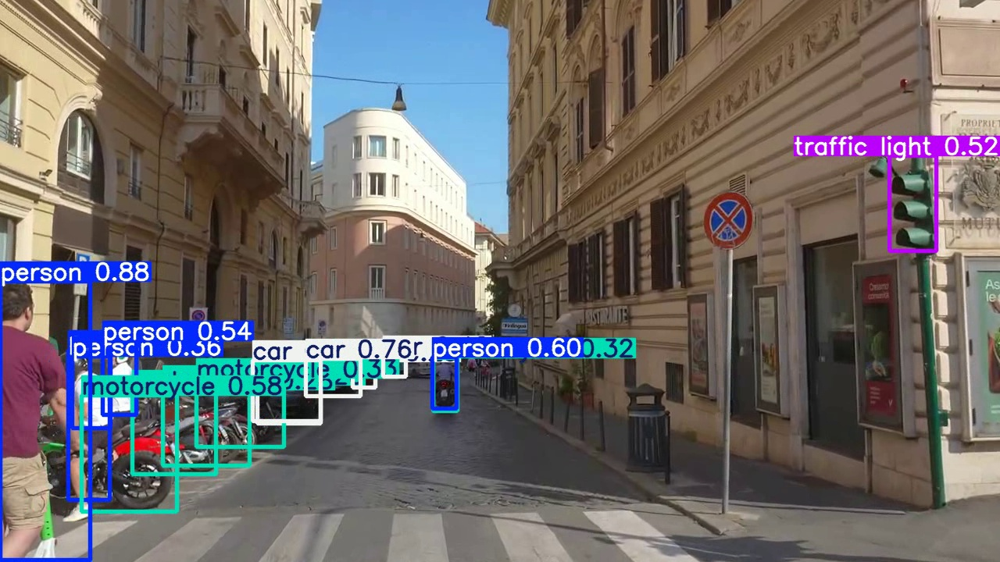
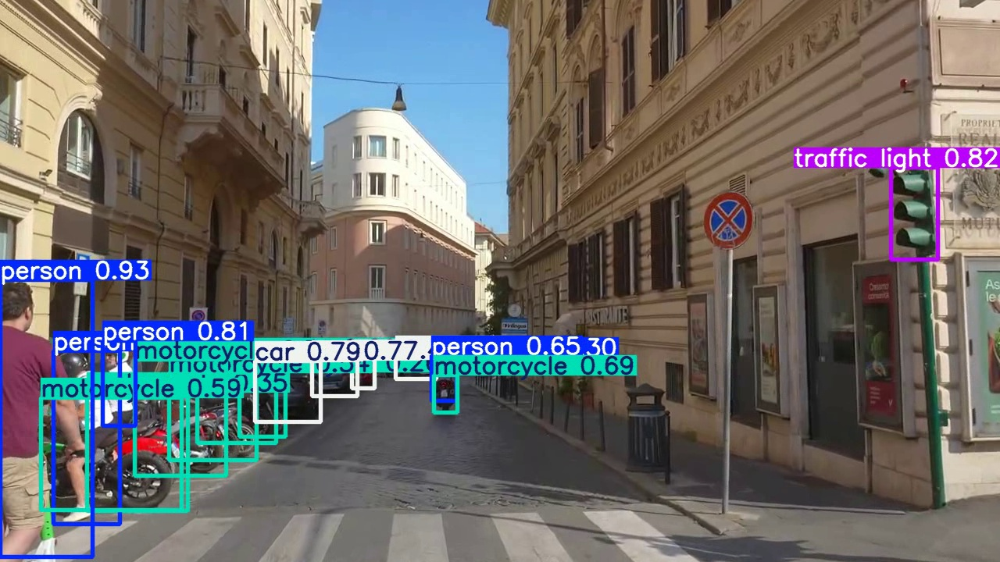
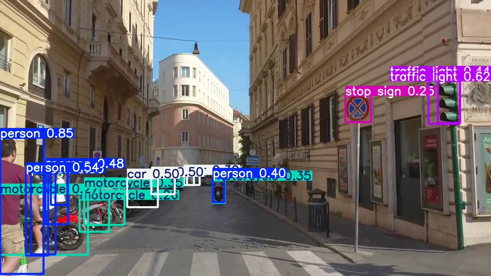
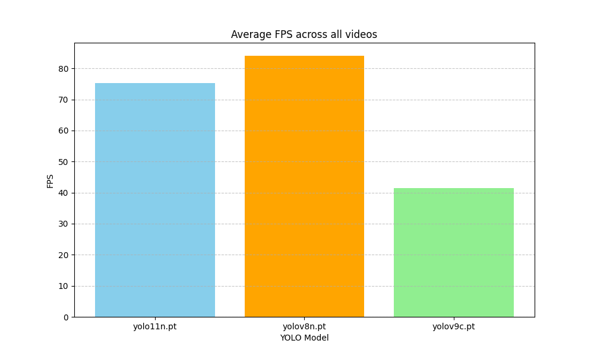
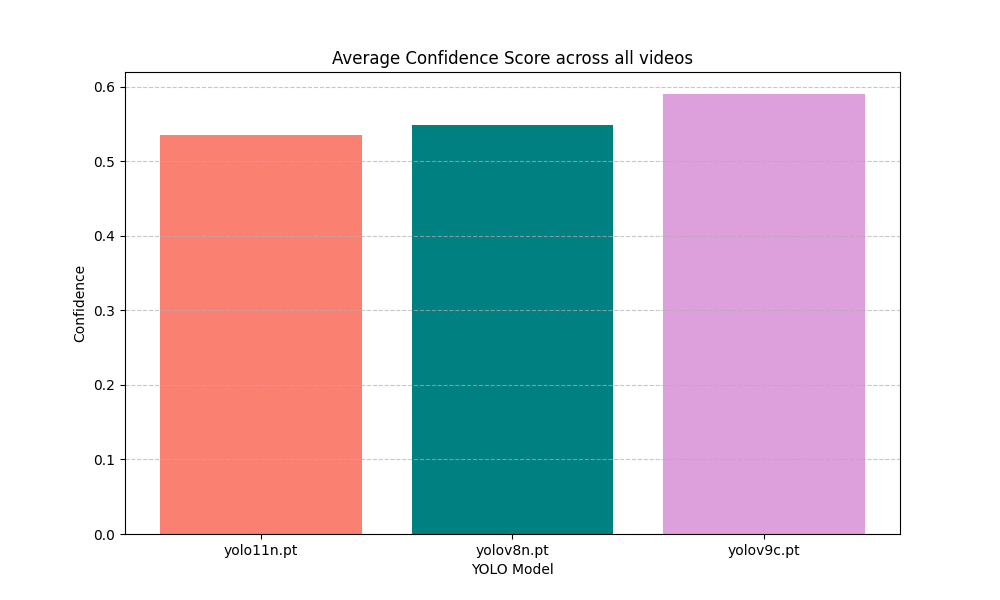
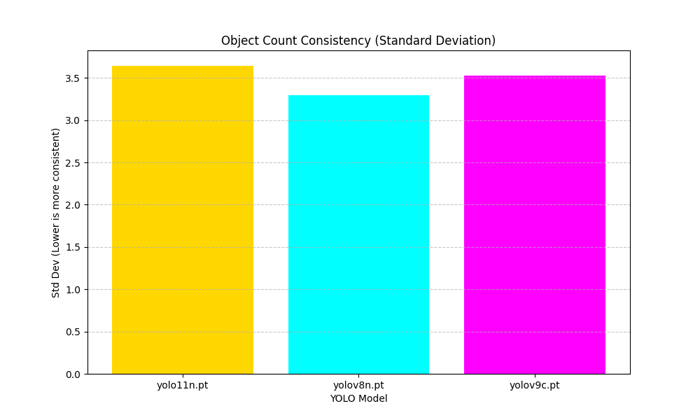

# YOLOv8 vs YOLOv9 vs YOLO11 Benchmarking Project

## Overview
This project provides a comprehensive benchmarking suite for comparing different iterations of the YOLO (You Only Look Once) architecture: **YOLOv8n**, **YOLOv9c**, and **YOLO11n**. It evaluates performance based on speed (FPS), accuracy (Confidence), and model complexity (Parameters) across multiple video datasets using CUDA acceleration.

## The Core Idea
As real-time object detection evolves, each new version of YOLO aims to optimize the balance between computational efficiency and detection quality. This project implementing a modular pipeline to empirically test these models on the same hardware and data.

## Project Structure
```text
C:\Ai_Expert\L46-Homework\
├── Assets\               # Source videos and baseline results
├── code\                 # Modular Python source code
│   ├── detectors\        # Model implementation logic (ABC pattern)
│   ├── evaluation\       # Metrics, tables, and visualization logic
│   ├── config.py         # Global configuration (Paths, Device, Models)
│   ├── video_processor.py # Frame-by-frame streaming and annotation
│   └── main.py           # Pipeline orchestrator
├── results\              # Benchmark data, charts, and automated conclusions
├── video_result\         # 6 Full-length annotated output videos
├── frame_comparison\     # Extracted Frame 100 for side-by-side analysis
└── README.md             # Project documentation and analysis
```

---

## Visual Comparison & Analysis (Frame 100)
To understand the real-world difference between these models, we extracted **Frame 100** from each video to perform a side-by-side qualitative analysis.

### Scenario 1: Ambulance.mp4 (Traffic Flow)
| YOLOv8n (Nano) | YOLOv9c (Compact) | YOLO11n (Nano) |
|:---:|:---:|:---:|
|  |  |  |

**Analysis:**
*   **Detection Density**: **YOLOv9c** detects significantly more vehicles in the background. It identifies smaller, distant cars that the Nano models (v8n/v11n) overlook.
*   **Confidence**: The bounding boxes in the YOLOv9c frame show higher confidence scores (often 0.8+), whereas the Nano models hover around 0.5-0.6 for the same objects.
*   **YOLOv11n vs v8n**: YOLO11n shows slightly tighter bounding boxes than YOLOv8n, indicating improved localization despite having fewer parameters.

### Scenario 2: rome.mp4 (High-Density Urban)
| YOLOv8n (Nano) | YOLOv9c (Compact) | YOLO11n (Nano) |
|:---:|:---:|:---:|
|  |  |  |

**Analysis:**
*   **Occlusion Handling**: In the dense Roman street, **YOLOv9c** excels at separating overlapping pedestrians and vehicles. It maintains detections even when objects are partially hidden.
*   **Accuracy**: YOLOv9c correctly identifies more static objects (parked scooters/cars) in the distance.
*   **Efficiency**: While YOLOv11n doesn't detect as many distant objects as v9c, it manages to match YOLOv8n's detection count while running significantly faster on the GPU, proving its efficiency as a next-gen Nano model.

---

## Detailed Results Analysis
This project consolidates data from multiple benchmarking phases. Below is a deep explanation of the results found in our subdirectories.

### 1. Baseline CPU Benchmark (`Assets/results.md`)
This initial test was conducted to establish a baseline using only the **CPU**. It compared the standard YOLOv8 variants against the experimental YOLOv10.

| Model       | Avg Inference (ms) | FPS   | Total Objects Detected | Model Size (M Parameters) |
|:------------|-------------------:|------:|-----------------------:|----------------------------:|
| yolov8n.pt  | 41.04              | 24.37 | 4700                   | 3.16                        |
| yolov8s.pt  | 97.33              | 10.27 | 8040                   | 11.17                       |
| yolov10n.pt | 50.74              | 19.71 | 4333                   | 2.78                        |

**Deep Explanation:**
*   **Significance**: This file shows the performance limit of consumer CPUs for real-time detection. 
*   **Comparison**: While YOLOv8n achieves near real-time (24 FPS) on CPU, the "Small" (v8s) variant drops to 10 FPS, making it unsuitable for live streams without acceleration.
*   **YOLOv10 vs v8**: YOLOv10n has a smaller memory footprint (2.78M params) but was slightly slower on this specific CPU architecture than YOLOv8n.

### 2. GPU Accelerated Comparison (`results/benchmark_results.md`)
This is the primary result set of the project, executed using **NVIDIA CUDA acceleration**.

| Model      | Video         | Avg Inference (ms) | FPS      | Total Detections | Avg Confidence | Consistency | Params (M) |
|:-----------|:--------------|:-------------------|:---------|:-----------------|:---------------|:------------|:-----------|
| yolov8n.pt | Ambulance.mp4 | 11.479             | 87.112 ★ | 4699             | 0.532          | 2.96 ★      | 3.157      |
| yolov8n.pt | rome.mp4      | 12.346             | 80.998   | 40031            | 0.566          | 3.626 ★     | 3.157      |
| yolov9c.pt | Ambulance.mp4 | 24.083             | 41.524   | 9671             | 0.559 ★        | 3.196       | 25.591     |
| yolov9c.pt | rome.mp4      | 24.248             | 41.241   | 49387            | 0.621 ★        | 3.859       | 25.591     |
| yolo11n.pt | Ambulance.mp4 | 15.255             | 65.551   | 4964             | 0.522          | 3.506       | 2.624 ★    |
| yolo11n.pt | rome.mp4      | 11.780             | 84.889 ★ | 42444            | 0.547          | 3.781       | 2.624 ★    |

---

## Visual Summary Charts

#### 1. Speed (FPS) Comparison

*   **Analysis**: The chart shows a massive performance gap between the **Nano** models (v8n, v11n) and the **Compact** model (v9c). 
*   **The Difference**: **YOLOv11n** and **YOLOv8n** achieve 80+ FPS because they are designed with a shallow architecture and very few parameters (~2.6M - 3.1M). In contrast, **YOLOv9c** (~25.5M parameters) is nearly 10x larger. Its use of **GELAN** (Generalized Efficient Layer Aggregation Network) and **PGI** (Programmable Gradient Information) creates a much deeper computational graph, which improves accuracy but limits throughput to around 40 FPS on the same hardware.

#### 2. Quality (Confidence) Comparison

*   **Analysis**: **YOLOv9c** is the clear winner in detection quality, especially in complex scenes.
*   **The Difference**: Because YOLOv9c has a higher parameter count, it can learn more complex spatial features. Its **PGI** technology specifically addresses the "information bottleneck" that occurs in deeper networks, allowing it to maintain high confidence for small or partially occluded objects that Nano models might only detect with 50% certainty. **YOLO11n** shows a slight drop in raw confidence compared to v8n, but as seen in the qualitative frames, it often provides better localization (tighter boxes).

#### 3. Stability (Consistency) Comparison

*   **Analysis**: This graph measures the Standard Deviation of object counts across frames (lower is better). **YOLOv8n** appears more "stable" here.
*   **The Difference**: Higher-capacity models like **YOLOv9c** are highly sensitive; they detect distant objects that may appear and disappear as light changes or other objects move. This "flicker" in the background increases the consistency metric (StdDev). **YOLOv8n**, being less sensitive to tiny details, produces a more consistent (though less complete) count. The architectural jump in **YOLO11** introduces more advanced attention mechanisms which, while powerful, can lead to more dynamic detection thresholds between consecutive frames in its default configuration.

## Setup & Usage

### 1. Environment Setup
```powershell
python -m venv venv
.\venv\Scripts\activate
pip install -r code/requirements.txt
```

### 2. Run Benchmark
```powershell
python code/main.py
```

## Honest Assessment
### What worked:
- **CUDA Acceleration**: Moving to GPU provided a 5x-10x speedup compared to initial CPU tests.
- **YOLOv9c Superiority**: Qualitative and quantitative results both confirm that the "Compact" variant is far superior for high-accuracy requirements.

### What needs improvement:
- **Tracking Logic**: The current script treats each frame independently. Implementing a tracker (like BoT-SORT) would reduce the "flicker" observed in the consistency metrics.

## Next Steps
- [ ] Integrate ByteTrack for improved object consistency across frames.
- [ ] Benchmark "Medium" and "Large" variants.
- [ ] Export models to TensorRT for even higher throughput on NVIDIA hardware.
